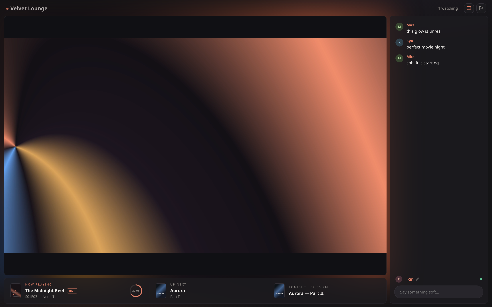
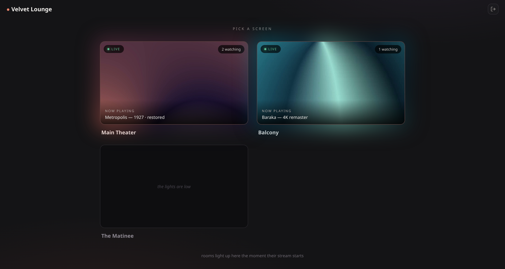
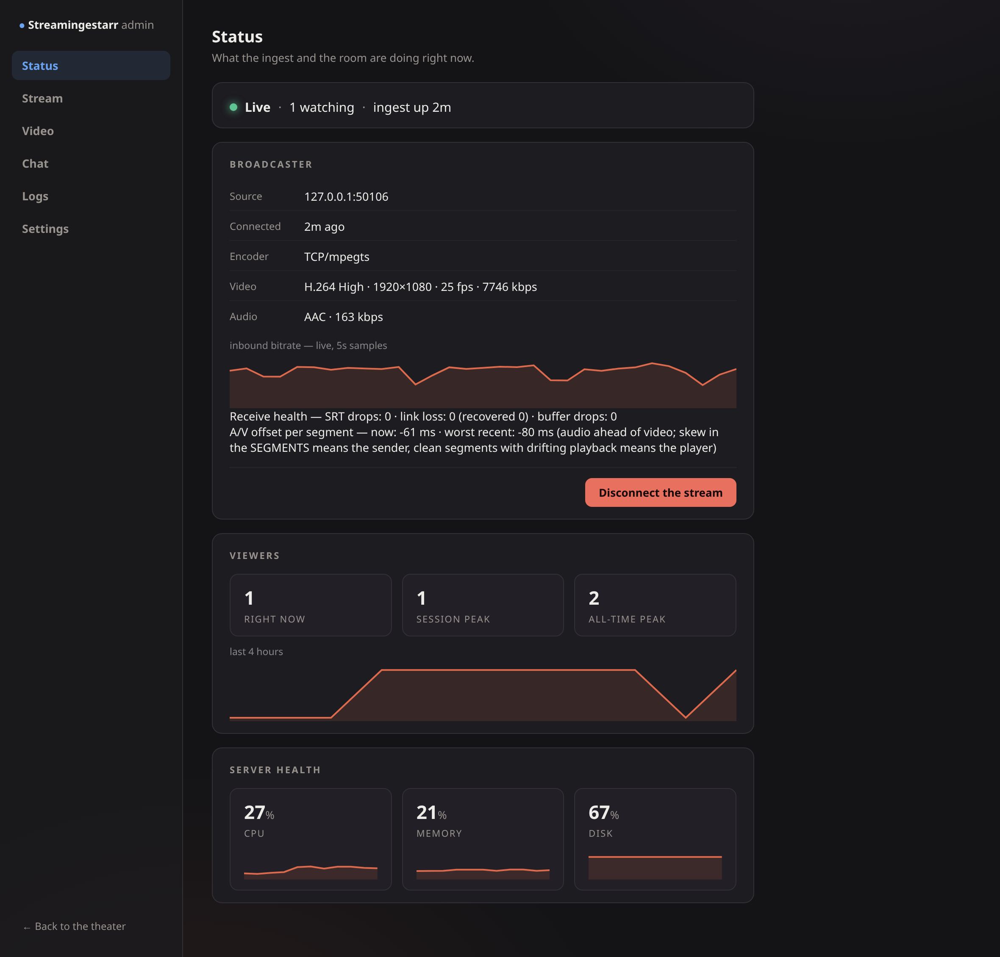
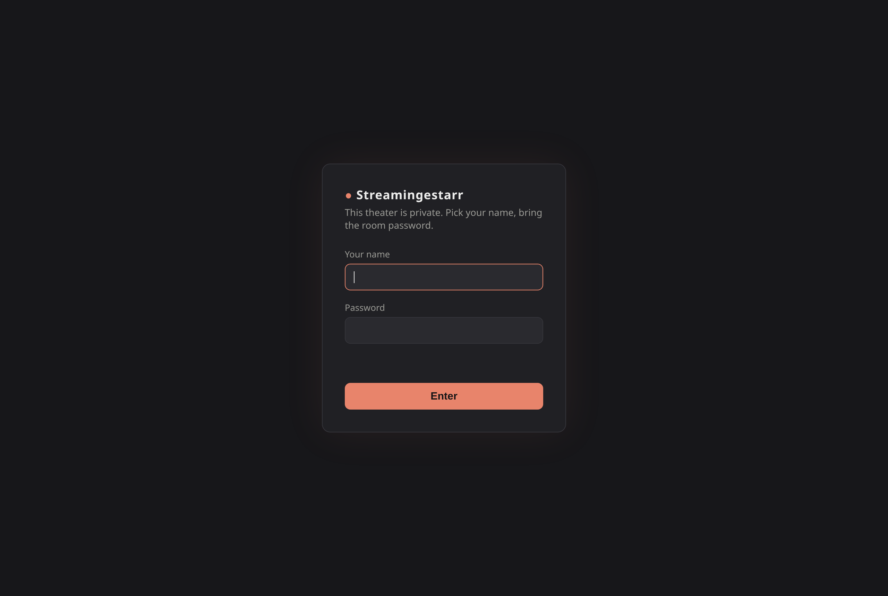

# Streamingestarr

**Your own private cinema.** A self-hosted live-streaming server — your ingest,
your theater page, your chat, behind a login you control.

<p align="center"></p>

Built as the receiving half of **[Streamerr](https://github.com/oroshikirin11/Streamerr)**,
its hybrid streaming service: Streamerr broadcasts your media library to this
server, which turns it into a watch-together theater. Install Streamerr on a
machine with **direct directory access to your media library** (preferred) —
SMB shares are supported as well. Any RTMP/SRT encoder (OBS included) works too.

## Rooms

<p align="center"></p>

One server, many theaters: every room takes its own inbound stream on the
same ports — the stream key decides where a broadcast lands. Own page, own
chat, own configuration; viewers pick a screen in the lobby.

## Setup — Docker

```sh
git clone https://github.com/oroshikirin11/Streamingestarr.git
cd Streamingestarr
docker compose up -d --build
```

Open `http://<host>:8080` — the first visit asks you to set the **room
password** (shared by everyone who watches) and your **admin password**.
Then in **admin → Stream**: copy an ingest address and the stream key into
your sender. That's the whole setup.

| Port | Purpose |
|---|---|
| `8080` | web + API (put a reverse proxy with TLS in front for the internet) |
| `1935` | RTMP ingest |
| `9710/udp` | SRT ingest |
| `9711` | raw-TCP ingest |

All state lives in `./data` (SQLite + HLS scratch). ffmpeg ships inside the
image. Update with `git pull && docker compose up -d --build`.

## Setup — Standalone

Requires Go ≥ 1.25, Node ≥ 20 and ffmpeg in `PATH`.

```sh
npm --prefix webapp install
npm --prefix webapp run build     # builds the web app into static/
go build -o streamingestarr .
./streamingestarr
```

Serves on `:8080`, creates `./data` next to the binary. Same first-run flow
as Docker.

## Screens

<p align="center"></p>
<p align="center"></p>

## Features

- **Ingest over RTMP, SRT or raw TCP** — H.264, HEVC and AV1, with HDR
  passthrough (PQ/HLG signalled to players). Optional SRT/TCP passphrases.
- **Passthrough-first**: source bytes ship untouched by default; a transcode
  ladder is there when you want it.
- **The theater**: ambilight glow sampled from the video, live chat with
  unique self-picked names, posters / up-next / tonight's schedule via a
  metadata API, HDR badge, sound-on join.
- **The room stays together**: every viewer is anchored to the same
  wall-clock moment — within ~100 ms of each other, stalls self-heal.
- **Rooms**: any number of independent theaters, created live from the
  admin — streams route by key, no extra ports.
- **Private by construction**: the login gate covers everything, including
  the video segments and the chat socket.
- **Operator's cockpit**: live inbound bitrate graph, receive-health
  counters, per-segment A/V offset ledger, CPU/memory/disk sparklines.
- **One binary, one folder**: Go + SQLite, `./data` is the only state.

## License

[PolyForm Noncommercial 1.0.0](LICENSE.md) — free to use, run, and modify for
any **noncommercial** purpose. Forks and derived versions are welcome, but
they inherit the same noncommercial terms: nobody can take this and sell it.

If Streamingestarr runs your theater and you want to say thanks:

<a href="https://buymeacoffee.com/oroshikirin11"></a>
